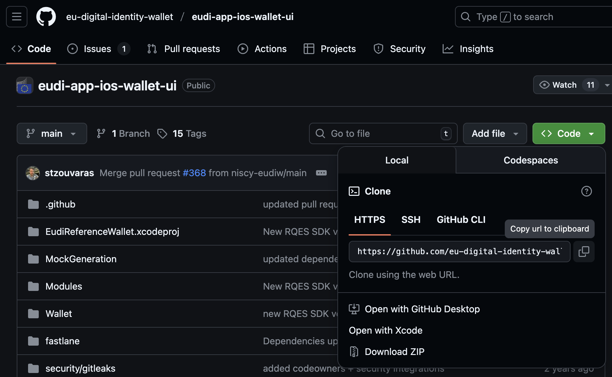
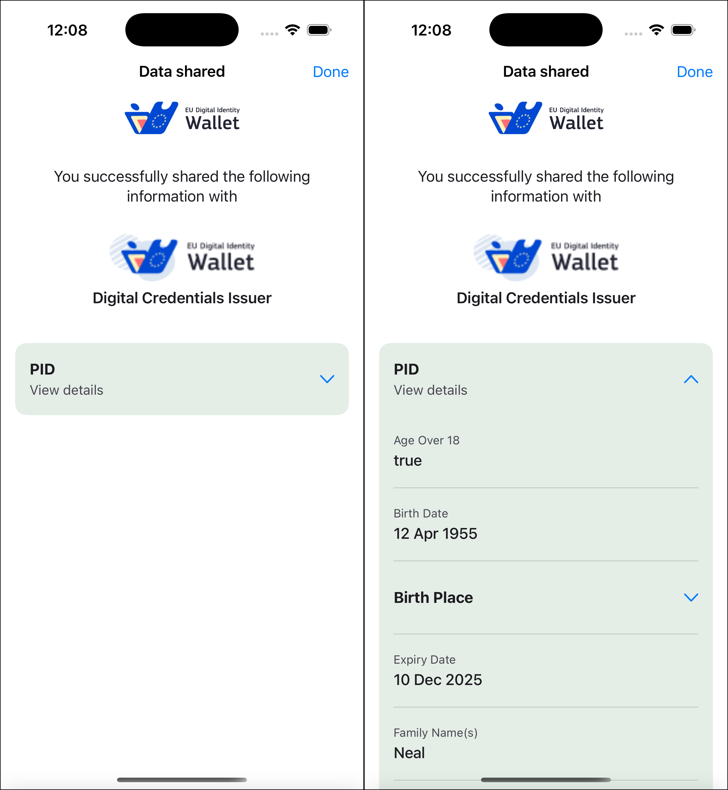

# EUDI iOS Wallet reference application セットアップガイド

## 1. はじめに

本ドキュメントでは、EUDI iOS Wallet reference application (以下ウォレットまたは EUDIWと呼ぶことがあります) のセットアップ手順について説明します。

この手順では、Mac にインストールされた XCode および iOS Simulator を使用して、EUDIW iOS Wallet を実行します。
システム要件につきましては、後述の [システム要件](#21-システム要件) をご確認ください。

## 2. 開発環境構築

### 2.1. システム要件

- OS: macOS Sequoia (Version 15.6) 以降推奨
- XCode: Version 16.2 以降推奨

XCode と macOS のバージョンの互換性については <https://developer.apple.com/jp/support/xcode/> をご確認ください。

### 2.2. XCode のセットアップ

1. App Store から XCode をインストールします
   - Spotlight Search, Launchpad などから App Store を開く → XCode を検索 → 入手
   - または <https://apps.apple.com/jp/app/xcode/id497799835?mt=12> にアクセスして App Store を起動 → 入手
2. XCode を起動します
   - Spotlight Search, Launchpad などから XCode を検索 → 起動
3. Xcode and Apple SDKs Agreement の画面が表示されたら Agree をクリックします
   
4. Continue をクリックして次に進みます
   
5. コンポーネントから iOS にチェック入れて install をクリックします
   

> [!TIP]
> コンポーネント選択画面が表示されない場合は、 Xcode → Settings → Components から iOS を追加してください。

### 2.3. Git のセットアップ

1. ターミナルを開き、 `git --version` を実行して Git のバージョン番号が表示されるか確認します
2. Git がインストールされていなかった場合は `brew install git` を実行してインストールします
   <https://git-scm.com/downloads/mac>
3. ターミナルを開き、以下のコマンドで名前とメールアドレスを設定します

  ```zsh
  git config --global user.name "あなたの名前"
  git config --global user.email "あなたのメールアドレス"
  ```

### 2.4. GitHub のセットアップ

GitHub のアカウントをお持ちでない場合は、アカウントを作成してください。
<https://docs.github.com/ja/get-started/start-your-journey/creating-an-account-on-github>

1. <https://github.com/> にアクセスします
2. Sign up からユーザー名・メールアドレス・パスワードを入力して登録します
3. メール認証を行います

## 3. リポジトリのクローンとチェックアウト

### 3.1. リポジトリのクローン

EUDI iOS Wallet reference application のリポジトリをローカルにクローンします。

1. <https://github.com/eu-digital-identity-wallet/eudi-app-ios-wallet-ui> を開きます
2. Code → Local → HTTPS からクローン用の URL をクリップボードにコピーします
   
3. ターミナルを開き、以下のコマンドでリポジトリをクローンします

   ```zsh
   git clone https://github.com/eu-digital-identity-wallet/eudi-app-ios-wallet-ui.git
   ```

### 3.2. 3.2 タグのチェックアウト (特定のバージョンへの切り替え)

git checkout コマンドを実行し、使用するバージョンへ切り替えます。

1. ターミナルを開き、以下のコマンドを実行します

   ```zsh
   cd eu-digital-identity-wallet
   git checkout Wallet/Demo_2025.07.28-Demo_Build=28
   ```

2. ターミナルに表示されていたブランチ名 (main) が @509f0255 に変わればチェックアウトは成功です
   

## 4. アプリの実行

1. ローカルリポジトリの EudiReferenceWallet.xcodeproj ファイルをダブルクリックして、Xcodeでプロジェクトを開きます
   
2. Xcode の File → Packages から Reset Package Caches クリックしてから、 File → Packages → Resolve Package Versions をクリックします
   
3. 下図を参考に、 Xcode画面の左上の Runボタン「▶︎」の右側にあるメニューから、アプリを動かすデバイス（例：iPhone16）を選んでください
   
4. その後、Runボタン「▶︎」をクリックすると シミュレータ上で EUDI iOS Wallet が起動します
   
5. 今後のログイン用に PIN を作成するように求められるため入力してください
   PIN 入力 (1回目) → Proceed → PIN 入力 (2回目) → Confirm
   
6. Add my Digital ID をクリックして次に進みます
   
7. 次のような画面が表示されたら起動は成功です
   

## 5. EUDIW テストサイトでの検証手順

EUDIW のテストサイト (Issuer / Verifier) と iOS Wallet の間で VC (PID) を発行し、検証する手順について説明します。

### 5.1. 発行テスト

1. ウォレットの画面で PID (sd-jwt-vcではない方) を選択し、次の画面で Continue をクリックします
   
2. Test Credentials Provider から FormEU を選択し、Submit をクリックします
   
3. 個人情報の入力画面が表示されるので、下記の項目を入力してください (例に従って入力すると確実に取得可能です)
   
   - Family Name (例: Neal)
   - Given Name (例: Tyler)
   - Birth Date (例: 1955−04-12)
   - Country (例: EU)
   - Region (例: test)
   - Locality (例: test)
   - Country (例: EU)
   - age_over_18 (例: True)
   - Portrait (例: Male を選択)
4. 確認画面が表示されるので、Authorize をクリックします
   
5. PID の発行が成功すると次のような画面が表示されるので、内容を確認して Done をクリックします
   
6. Wallet のアクティベートが完了し Home 画面が表示されるので、画面下部の Documents をクリックし、取得した PID を確認します
   

### 5.2. 検証テスト

1. iOS Simulator の Safari で <https://verifier.eudiw.dev> にアクセスします
   
2. ... select attestation(s) の Person Identification Data (PID) から次の内容を選択し、Next をクリックします
   
   - attributes by: All attributes
   - format: ms_mdoc
3. ... select attestation(s) attributes の Next をクリックします
   
4. ... select request options and submit で次の内容を選択し、Next をクリックします
   
   - Presentation Query Type: DCQL
   - Request URI Method: GET
5. OPEN WITH YOUR WALLET をクリックし、出現したダイアログで Open をクリックします
   
6. ウォレットが起動し、Data sharing request の画面が表示されるので、提示するアイテムすべてにチェックが入っていることを確認し Share をクリックします
   (デフォルトの状態ですべてにチェックが入っています)
   
7. PIN を入力します
   
8. 提示と検証が完了すると次のような画面が表示されるので、内容を確認して Done をクリックします
   
9. Safari に提示した情報が表示されます
   

## 6. 電通総研テストサイトでの検証手順

### 6.1. PID によるアクティベーションをスキップする

EUDI iOS Wallet は仕様により PID を取得してアクティベートされるまでは、mDL などその他のドキュメントを取得できません。
この制限を解除して、PID 未取得の状態でも様々なドキュメントが取得できるように設定していきます。

1. XCode でプロジェクトを開き、画面左側のファイルツリーから次のファイルを開きます
   EudiReferenceWallet/Packages/feature-issuance/Sources/interactor/AddDocumentInteractor.swift
2. fetchScopedDocuments を下記のように変更します (同様の処理になれば他の書き方でも問題ありません)

   ```diff
   public func fetchScopedDocuments(with flow: IssuanceFlowUiConfig.Flow) async -> ScopedDocumentsPartialState {
      do {
         let documents: [AddDocumentUIModel] = try await walletController.getScopedDocuments().compactMap { doc in
         if flow == .extraDocument || doc.isPid {
            return .init(
               listItem: .init(
               mainText: .custom(doc.name),
               trailingContent: .icon(Theme.shared.image.plus)
               ),
               isEnabled: true,
               configId: doc.configId,
               docTypeIdentifier: doc.docTypeIdentifier
            )
         } else {
   -          return nil
   +          return .init(
   +            listItem: .init(
   +              mainText: .custom(doc.name),
   +              trailingContent: .icon(Theme.shared.image.plus)
   +            ),
   +            isEnabled: true,
   +            configId: doc.configId,
   +            docTypeIdentifier: doc.docTypeIdentifier
   +          )
         }
         }.sorted(by: compare)
         return .success(documents)
      } catch {
         return .failure(error)
      }
   ```

3. Xcode画面の左上の Runボタン「▶︎」を押し、ウォレットを起動すると、PID を所持していない状態でも mDL などのドキュメントが取得できるようになります
   (後述の PID を発行しない Issuer を指定した場合のウォレットの初回起動時の画面、左: 設定前、右:設定後)
   

### 6.2. Issuer 接続情報の変更

ウォレットが電通総研の Issuer に接続できるよう設定していきます。

1. XCode でプロジェクトを開き、画面左側のファイルツリーから次のファイルを開きます
   EudiReferenceWallet/Packages/logic-core/Sources/Config/WalletKitConfig.swift
2. vciConfig を下記のように変更します

   ```diff
   var vciConfig: VciConfig {
      return switch configLogic.appBuildVariant {
      case .DEMO:
         .init(
   -          issuerUrl: "https://issuer.eudiw.dev",
   -          clientId: "wallet-dev",
   -          redirectUri: URL(string: "eu.europa.ec.euidi://authorization")!,
   +          issuerUrl: "https://dentsusoken-vc-issuer.g-trustedweb.workers.dev",
   +          clientId: "1022651389",
   +          redirectUri: URL(string: "dentsusoken-vc://authorize/")!,
            usePAR: true,
            useDPoP: true
         )
   ```

3. Xcode画面の左上の Runボタン「▶︎」を押し、ウォレットを起動すると設定した Issuer と自動的に接続されます

### 6.3. 電通総研 Issuer から mDL を取得する

1. ウォレットホーム画面下部の Documents を開き、画面右上の + ボタンをクリックします
   
2. Choose from list をクリックします
   
3. org.iso.18013.5.1.mDL をクリックし、ダイアログが表示されたら Continue をクリックします
   
4. Login ID: inga, Password: inga を入力して Authorize をクリックします
   
5. mDL の発行が成功すると次のような画面が表示されるので、内容を確認して Done をクリックします
   
6. 取得した mDL を確認します
   

### 6.4 電通総研 Verifier に mDL を提示する

現在、EUDI iOS Wallet から電通総研 Verifier へのドキュメントの提示はできません。

<!-- 
1. iOS Simulator の Safari で <https://oid4vc-verifier-frontend-hono.g-trustedweb.workers.dev> にアクセスします
   
2. ... select attestation(s) の Person Identification Data (PID) から次の内容を選択し、Next をクリックします
   
   - attributes by: All attributes
   - format: ms_mdoc
3. ... select attestation(s) attributes の Next をクリックします
   
4. ... select request options and submit で次の内容を選択し、Next をクリックします
   
   - Presentation Query Type: DCQL
   - Request URI Method: GET
5. OPEN WITH YOUR WALLET をクリックし、出現したダイアログで Open をクリックします
   
6. ウォレットが起動し、Data sharing request の画面が表示されるので、提示するアイテムすべてにチェックが入っていることを確認し Share をクリックします
   (デフォルトの状態ですべてにチェックが入っています)
   
7. PIN を入力します
   
8. 提示と検証が完了すると次のような画面が表示されるので、内容を確認して Done をクリックします
   
9. Safari に提示した情報が表示されます
    -->

## 7. 参考情報

### 7.1. iOS Simulator キーボード設定

キーボードから iOS Simulator の画面に入力ができない場合、I/O → Keyboard → Connect Hardware Keyboard にチェックが入っているか確認してください。


### 7.2. iOS Simulator リセット

iOS Simulator を初期状態にリセットするには、Device → Erase All Content and Settings を実行してください。
(ウォレットに保存されたデータ、ウォレットアプリ、Safari のブックマークなどもすべて削除されます)


