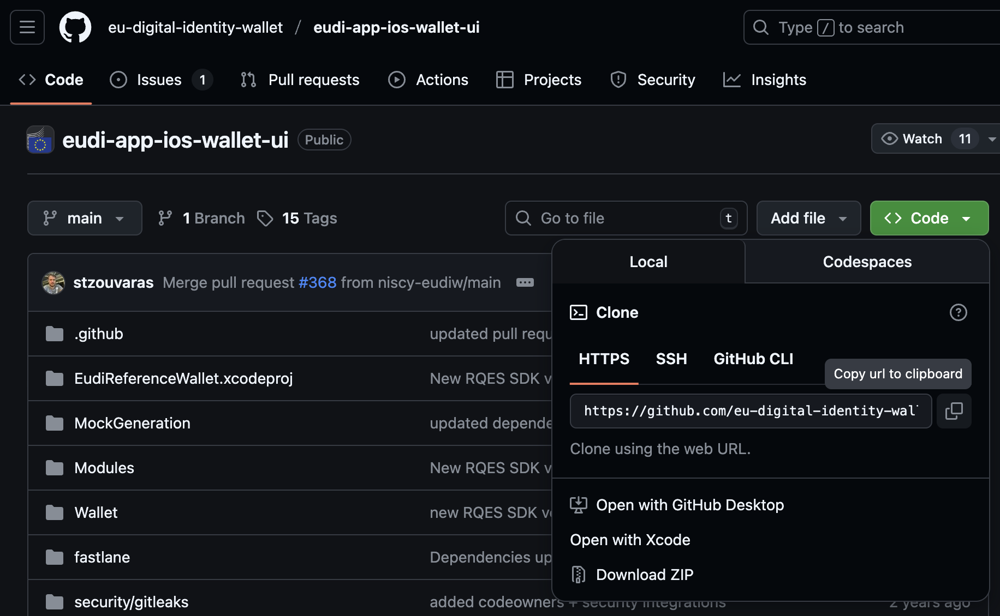

# EUDI Verifier Endpoint セットアップガイド

## 1. はじめに

本ドキュメントでは、EUDI Verifier Endpoint のセットアップ手順について説明します。

この手順は、EUDI iOS Wallet reference application (以下ウォレットまたは EUDIWと呼ぶことがあります) と同一マシンで実行することを想定しています。
システム要件につきましては、後述の [システム要件](#21-システム要件) をご確認ください。

## 2. 開発環境構築

### 2.1. システム要件

- EUDI iOS Wallet reference application を実行するホストと同一マシンを想定
- OS: macOS Sequoia (Version 15.6) 以降推奨
- docker: version 28.3 以降
- VS Code などのテキストエディタ

### 2.2. Git のセットアップ

このセットアップガイドでは Git コマンドを使用します。
[setup-ios-wallet.md 2.3. Git のセットアップ](./setup-ios-wallet.md#23-git-のセットアップ) を確認のうえ、セットアップを行ってください。

### 2.3. GitHub のセットアップ

このセットアップガイドの操作には GitHub アカウントが必要な箇所があります。
[setup-ios-wallet.md 2.4. GitHub のセットアップ](./setup-ios-wallet.md#24-github-のセットアップ) を確認のうえ、セットアップを行ってください。

## 3. リポジトリのクローンとチェックアウト

### 3.1. リポジトリのクローン

次の2つのリポジトリをローカルにクローンします。

- <https://github.com/eu-digital-identity-wallet/eudi-srv-web-verifier-endpoint-23220-4-kt> (バックエンドサーバーおよびプロキシサーバー)
- <https://github.com/eu-digital-identity-wallet/eudi-web-verifier> (フロントエンドサーバー)

1. <https://github.com/eu-digital-identity-wallet/eudi-app-ios-wallet-ui> を開きます
2. Code → Local → HTTPS からクローン用の URL をクリップボードにコピーします  
   
   (画像は別のリポジトリのものです)
3. ターミナルを開き、`git clone` の後にコピーした文字列を貼り付けて実行し、リポジトリをクローンします

   ```zsh
   git clone https://github.com/eu-digital-identity-wallet/eudi-srv-web-verifier-endpoint-23220-4-kt.git
   ```

4. <https://github.com/eu-digital-identity-wallet/eudi-web-verifier>
5. 同様にもう一つのリポジトリもクローンします

   ```zsh
   git clone https://github.com/eu-digital-identity-wallet/eudi-web-verifier.git
   ```

### 3.2. タグのチェックアウト (特定のバージョンへの切り替え)

`git checkout` コマンドを実行し、使用するバージョンへ切り替えます。
それぞれのリポジトリで使用するバージョンは次の通りです。

- eudi-srv-web-verifier-endpoint-23220-4-kt: v0.5.3
- eudi-web-verifier: v0.8.2

1. ターミナルを開き、以下のコマンドを実行します

   ```zsh
   cd eudi-srv-web-verifier-endpoint-23220-4-kt
   git checkout v0.5.3
   git log
   ```

2. `git log` の結果が表示されたら、一番上の commit に `(HEAD, tag: v0.5.3)` の表示がればチェックアウトは成功です
3. 同様にもう一つのリポジトリもチェックアウトします

   ```zsh
   cd eudi-web-verifier
   git checkout v0.8.2
   git log
   ```

4. `git log` の結果が表示されたら、一番上の commit に `(HEAD, tag: v0.8.2)` の表示があればチェックアウトは成功です

## 4. 起動設定

### 4.1. バックエンドサーバーおよびプロキシサーバーの設定

1. 必要なファイルを eudi-srv-web-verifier-endpoint-23220-4-kt ディレクトリへコピーします

   ```zsh
   cd path/to/eudi-ri-setup/data/eudi-srv-web-verifier-endpoint-23220-4-kt
   cp changes.patch path/to/eudi-srv-web-verifier-endpoint-23220-4-kt/
   cp -r docker/* path/to/eudi-srv-web-verifier-endpoint-23220-4-kt/docker/
   ```

2. 次の手順でプロキシサーバーの TLS 証明書を作成します

   ```zsh
   cd path/to/eudi-srv-web-verifier-endpoint-23220-4-kt/docker/tls-cert
   ./make-localhost-cert.sh
   ```

3. 続けて iOS Simulator に証明書をインポートして信頼設定します
   **この操作は iOS Simulator で使用する iPhone の画面が表示されている状態で実行してください**

   ```zsh
   ./simctl-add-cert.sh
   ```

4. 次の手順で Verifier の証明書やキーストアなどを作成します

   ```zsh
   cd path/to/eudi-srv-web-verifier-endpoint-23220-4-kt/docker/verifier-cert
   ./make-localhost-cert.sh
   ```

5. パッチファイルから修正内容を反映します

   ```zsh
   git apply --check changes.patch
   # エラーが表示されたら次の行は実行せず、手動でファイルを修正してください
   git apply --verbose changes.patch
   ```

### 4.2. フロントエンドサーバーの設定

1. 必要なファイルを eudi-web-verifier ディレクトリへコピーします

   ```zsh
   cd path/to/eudi-ri-setup/data/eudi-web-verifier
   cp * path/to/eudi-web-verifier/
   ```

2. パッチファイルから修正内容を反映します

   ```zsh
   git apply --check changes.patch
   # エラーが表示されたら次の行は実行せず、手動でファイルを修正してください
   git apply --verbose changes.patch
   ```

## 5. アプリの実行

eudi-srv-web-verifier-endpoint-23220-4-kt (バックエンド、プロキシサーバー) と eudi-web-verifier (フロントエンド) を起動します。
Verifier に VC フォーマットを追加したい場合は、後述の [新しい VC フォーマットの追加](#6-新しい-vc-フォーマットの追加) も合わせて実施してください。

### 5.1. バックエンドサーバーおよびプロキシサーバーの起動

バックエンドサーバーおよびプロキシサーバーは Docker コンテナで起動します。

1. ターミナルで eudi-srv-web-verifier-endpoint-23220-4-kt の docker ディレクトリに移動し、起動スクリプトを実行します

   ```zsh
   cd path/to/eudi-srv-web-verifier-endpoint-23220-4-kt/docker
   ./up.sh
   ```

2. 次のような表示が出たら起動は成功です

   ```console
   project    NAMES              PORTS                                         STATUS
   verifier   verifier-haproxy   0.0.0.0:443->443/tcp, [::]:443->443/tcp       Up Less than a second
   verifier   verifier-backend   0.0.0.0:8080->8080/tcp, [::]:8080->8080/tcp   Up Less than a second
   ```

3. 終了する場合は `./down.sh` を実行してください

### 5.2. フロントエンドサーバーの起動

フロントエンドは Angular で構築されており、サーバーの起動には `ng serve` コマンドを使用します。
`ng serve` コマンドを実行すると、開発サーバーが起動して処理が続くため、コマンドを実行したターミナルはその間使い続けられません。別の作業をする場合は、新しいターミナルを開いて操作してください。

1. ターミナルで eudi-web-verifier ディレクトリに移動し、起動スクリプトを実行します

   ```zsh
   cd path/to/eudi-web-verifier
   ./run-dev.sh
   ```

2. 初回の起動時は、`npm install` の処理に数分かかることがあります
3. エラーが発生せず、次のような表示が出たら起動は成功です

   ```console
   Application bundle generation complete. [2.023 seconds]

   Watch mode enabled. Watching for file changes...
   NOTE: Raw file sizes do not reflect development server per-request transformations.
   ➜  Local:   http://localhost:4200/
   ➜  Network: http://192.168.1.49:4200/
   ➜  press h + enter to show help
   ```

4. 終了する場合は、キーボードで `ctrl + c` と入力してください

### 5.3. 接続テスト

フロントエンド、バックエンド、プロキシの各サーバーが起動した状態での接続テストの方法について説明します。

1. iOS Simulator を起動し、Safari を開きます
2. アドレスバーに `https://localhost` または `https://localhost:443` と入力します
3. EUDIW の Verifier ウェブベージが表示されます
   (信頼設定の問題でページが表示できない場合、 [バックエンドサーバーおよびプロキシサーバーの設定](#41-バックエンドサーバーおよびプロキシサーバーの設定) の信頼設定を実施してください)
4. [setup-ios-wallet.md](./setup-ios-wallet.md) の "検証テスト" の手順で iOS Wallet から Verifier への提示ができることを確認します

## 6. 新しい VC フォーマットの追加

Verifier に新しい VC フォーマットを追加する方法について説明します。
フォーマットを追加するには、フロントエンド (eudi-web-verifier) のソースコードを編集します。

### 6.1. attestation-definitions.ts

VS Code などのテキストエディタで下記のファイルを開き、新しい VC フォーマットの定義を追加します。

eudi-web-verifier/src/app/core/constants/attestation-definitions.ts

```ts
前略
// ここに 新しい VC フォーマットを実装
export const UNIFIED_ID_ATTESTATION: AttestationDefinition = {
  name: "Unified ID",
  type: AttestationType.UNIFIED_ID,
  dataSet: [
    { identifier: 'type', attribute: 'Type'},
    { identifier: 'issuer', attribute: 'Issuer'},
    { identifier: 'service', attribute: 'Service'},
    { identifier: 'user_id', attribute: 'User ID'},
    { identifier: 'unified_id', attribute: 'Unified ID'},
    { identifier: 'issue_date', attribute: 'Issuance date'},
    { identifier: 'expiry_date', attribute: 'Expiry date'},
  ]
}
中略
export const SUPPORTED_ATTESTATIONS: { [id: string]: AttestationDefinition } = {
  // ここに id 文字列の定義を追加
  "unified_id": UNIFIED_ID_ATTESTATION,
}
後略
```

### 6.2. attestations-per-format.ts

VS Code などのテキストエディタで下記のファイルを開き、新しい VC フォーマットの定義を追加します。

eudi-web-verifier/src/app/core/constants/attestations-per-format.ts

```ts
import {/* ここに attestation-definitions.ts に実装した定義を追加 */ UNIFIED_ID_ATTESTATION} from "@core/constants/attestation-definitions";
中略
// ここに 新しい VC フォーマットを実装
/*---- UNIFIED ID ATTESTATION INSTANCES PER FORMAT ----*/
export const UNIFIED_ID_MSO_MDOC: MsoMdocAttestation = {
  format: AttestationFormat.MSO_MDOC,
  attestationDef: UNIFIED_ID_ATTESTATION,
  doctype: 'com.dentsusoken.vecrea.UnifiedID',
  namespace: 'com.dentsusoken.vecrea.UnifiedID',
  attributePath: (attribute: DataElement) => { return msoMdocAttributePath(attribute, 'com.dentsusoken.vecrea.UnifiedID') },
  claimQuery: (attribute: DataElement) => { return msoMdocClaimQuery('com.dentsusoken.vecrea.UnifiedID', attribute.identifier) }
}
中略
export const ATTESTATIONS_BY_FORMAT: { [id: string]: Attestation[] } = {
  "mso_mdoc": [/* ここに 新しい VC フォーマットを追加 */  UNIFIED_ID_MSO_MDOC],
後略
```

### 6.3. AttestationType.ts

VS Code などのテキストエディタで下記のファイルを開き、新しい VC フォーマットの定義を追加します。

eudi-web-verifier/src/app/core/models/attestation/AttestationType.ts

```ts
export enum AttestationType {
   // ここに 新しい VC フォーマットを追加
   UNIFIED_ID="unified_id",
}
```
